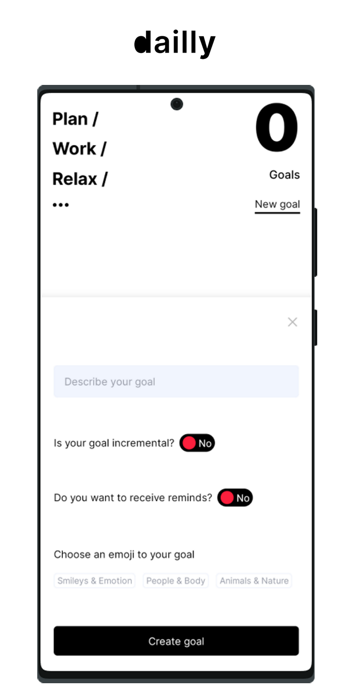

# Dailly

Create, manage and track your daily goals.

<details>
  <summary>Screenshots</summary>

  
  
  
  
  
</details>

[](https://play.google.com/store/apps/details?id=com.dailly.dailly)

## About

The main goal of this application is privacy and simplicity. No trackers, no ADS and no databases.

## Metrics

[](https://www.codacy.com?utm_source=github.com&utm_medium=referral&utm_content=hydroxion/dailly&utm_campaign=Badge_Grade)

## Built with

- [Javascript](https://developer.mozilla.org/en-US/docs/Web/JavaScript)
- [React](https://reactjs.org/)
- [React Native](https://reactnative.dev/)
- [Expo](https://expo.io/) (managed workflow)

## Installation

Use the package manager [Yarn](https://yarnpkg.com/getting-started/install) to install the dependencies.

```bash
yarn
```

Use the IDE [Android Studio](https://developer.android.com/studio/install) to create a virtual device or [Expo Go](https://expo.io/client), to run the application while in development.

> Notice that some APIs are only available in real devices, i.e through binary installation, Expo Go or USB connection

## Usage

Start the application server.

```sh
yarn start
```

Open [localhost:19002](http://localhost:19002/) where a QR code can be scanned using Expo Go or launch the application in a virtual or real device, by pressing `a` in the CLI.

> Optionally you start the application server to run directly in a device using `yarn android`

To build the application see the [reference](https://docs.expo.io/distribution/building-standalone-apps/#3-start-the-build).

## Roadmap

Check the [project board](https://github.com/hydroxion/dailly/projects).

## Contributing

Pull requests are welcome. Please, consider the following.

1. To merge your change, create an issue and a PR related to that issue
2. Describe which interface changed, which bug was fixed or what new feature was created
3. Check the quality and performance of your code
4. If you're stuck in a problem, create a question in the [discussions](https://github.com/hydroxion/dailly/discussions) area

> No issue or PR template required, but try to be informative

## License

[MIT](./LICENSE.md)

## Stores

[Play Store](https://play.google.com/store/apps/details?id=com.dailly.dailly)

[G2](https://www.g2.com/products/dailly/reviews)

[Expo](https://expo.io/@sphinxs/projects/dailly)

## Privacy

For privacy issues read the application [Privacy Policy](https://audaxly.com/privacy-policy?code=kojej1j04hvs8e).

## Contact

Contact at <a href="mailto:hello.dailly@gmail.com">hello.dailly@gmail.com</a>.
